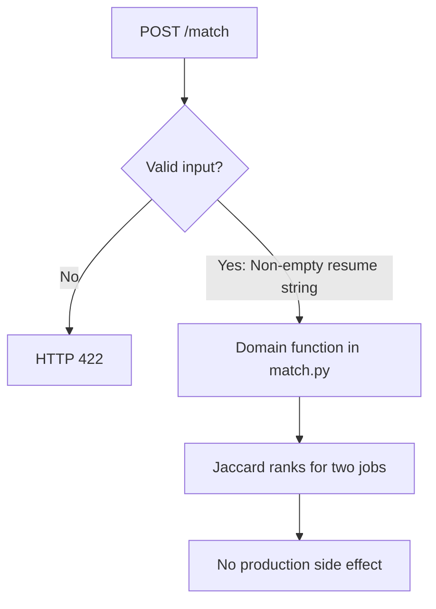

# Resume–Job Matching Engine: process flows

## Domain request

Endpoint: `POST /match`. Stages summarize [src/jobmatch/match.py](../src/jobmatch/match.py). This is in-process Python, not a hosted model or production apply.

See [INTERVIEW_QA.md](../INTERVIEW_QA.md) for fixture walkthroughs and [PROJECT_ARCHITECTURE.md](../PROJECT_ARCHITECTURE.md) for the component map.
